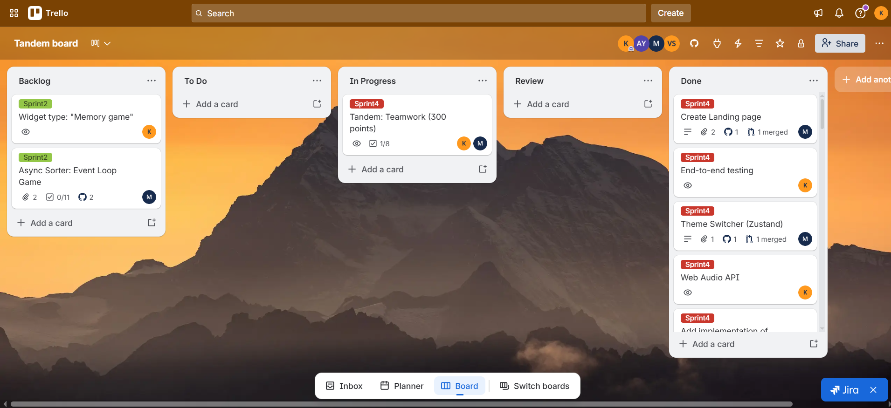

# Widget Trainer

## О проекте

**Widget Trainer** - интерактивный тренажёр для разработчиков, который превращает изучение JavaScript в игровой процесс. Платформа предлагает 4 типа виджетов (Quiz, True/False, Code Ordering, Code Completion), систему ачивок и лидерборд, отслеживание прогресса и слабых тем.

**Стек:** React 19, TypeScript, Zustand, Supabase, react-hook-form + Zod, i18next (EN/RU), Vite.

**Деплой:** [Widget Trainer на Vercel](https://tandem-virid.vercel.app/)

### Демо-видео

[Демо-видео](https://www.youtube.com/watch?v=6dPcSQnuSBQ)

### Чем гордимся

API Service Layer полностью изолирует UI от источника данных - компоненты вызывают стор, стор вызывает API-сервисы, и только они знают про Supabase. Замена бэкенда затронет лишь файлы в `src/api/`, не трогая ни одного компонента. Widget Engine построен на паттерне Strategy: каждый тип виджета регистрирует свой компонент в реестре, а Engine по полю `type` находит нужную стратегию и рендерит её - добавление нового типа виджета не требует изменения существующего кода. Toast Notification System реализована без сторонних библиотек: глобальный Zustand-стор позволяет вызвать уведомление из любого слоя приложения одной строкой, с автоматическим dismiss и CSS-анимацией. Модуль профиля работает через react-hook-form + Zod с типизированной валидацией, а маппинг `snake_case`/`camelCase` между API и клиентом спрятан в сервисном слое. Страница Library реализует клиентскую фильтрацию по тегам, сложности и текстовому поиску одновременно, с мемоизацией через `useMemo`. Dashboard собирает аналитику в реальном времени: ачивки вычисляются из истории результатов, слабые темы определяются по порогу и ведут к практике в один клик, лидерборд строится через Supabase RPC. Всё приложение полностью двуязычное - включая ошибки валидации форм, ачивки, UI-состояния и системные сообщения.

---

## Команда

| Участник                   | GitHub                                             | Дневник разработки                                                                                                           |
| :------------------------- | :------------------------------------------------- | :--------------------------------------------------------------------------------------------------------------------------- |
| Dmitriy Karpov (Team Lead) | [@KarpovDmitriy](https://github.com/KarpovDmitriy) | [development-notes/karpovdmitriy](https://github.com/KarpovDmitriy/widget-trainer/tree/main/development-notes/karpovdmitriy) |
| Maryna Drob                | [@dromari](https://github.com/dromari)             | [development-notes/dromari](https://github.com/KarpovDmitriy/widget-trainer/tree/main/development-notes/dromari)             |

### Менторы

| Ментор            | GitHub                                         |
| :---------------- | :--------------------------------------------- |
| Vitaliy Shelepkov | [@av-shell](https://github.com/av-shell)       |
| Alena Yakimovich  | [@ayaki-coder](https://github.com/ayaki-coder) |

---

## Доска

**Ссылка:** [Trello Board](https://trello.com/b/HMCtQUS9/tandem-board)

**Скриншот:**



---

## Лучшие PR

1. [PR #1 - Add service api layer for login, register and profile pages + save and update profile logic](https://github.com/KarpovDmitriy/widget-trainer/pull/26)
2. [PR #2 - Add widget engine with two types of widgets, add library page with filtering, + db migrations](https://github.com/KarpovDmitriy/widget-trainer/pull/36)
3. [PR #3 - Add profile page](https://github.com/KarpovDmitriy/widget-trainer/pull/17)
4. [PR #4 - Add i18n structure ts files and t() helper](https://github.com/KarpovDmitriy/widget-trainer/pull/29)

---

## Meeting Notes

### Meeting #1 - 2026-02-24 (Планирование Sprint 2)

**Участники:** Dmitriy Karpov, Maryna Drob

**Повестка:** Подведение итогов первого спринта, планирование Sprint 2.

**Обсуждали:**

- Обсудили скелет проекта и в каких ветках ведём разработку. Решили, что `main` защищён от прямых пушей, вся работа идёт через PR.
- Maryna показала готовые страницы Login и Register, обсудили замечания: нужно выносить компоненты (Button, Input), убрать дублирование стилей.
- Dmitriy рассказал про настройку ESLint, Prettier, routing. Решили, что Dmitriy берёт на себя backend (Supabase), а Maryna продолжает работу над UI-компонентами.
- Раскидали задачи на Sprint 2: Dmitriy - CI pipeline + Supabase + API Service Layer; Maryna - Profile Page + рефакторинг auth-страниц.

**Итоги:** Задачи распределены, сроки согласованы. Следующий созвон назначен после завершения Sprint 2.

---

### Meeting #2 - 2026-03-02 (Ретроспектива Sprint 2)

**Участники:** Dmitriy Karpov, Maryna Drob

**Повестка:** Ревью результатов Sprint 2, обсуждение проблем с блокировкой задач.

**Обсуждали:**

- Dmitriy показал работающий CI pipeline и подключённый Supabase. Обсудили структуру таблиц: решили использовать встроенную auth Supabase для регистрации, а для профиля создать отдельную таблицу `user_profiles` с триггером.
- Maryna подняла проблему: блокируется разработка дальнейших компонентов, пока не замержен PR. Договорились, что PR ревьюятся в течение 1–2 дней, чтобы не блокировать друг друга.
- Обсудили систему оценки проекта: кто какие компоненты пишет, чтобы баллы распределялись равномерно.
- Dmitriy сделал первое ревью PR коллеги - нашёл замечания по стилям и TS. Договорились делать ревью более детально.

**Итоги:** Согласовали правило по срокам ревью. Dmitriy начинает API Service Layer. Maryna берёт Toast System и i18n.

---

### Meeting #3 - 2026-03-23 (Планирование финального спринта)

**Участники:** Dmitriy Karpov, Maryna Drob

**Повестка:** Статус Widget Engine, распределение оставшейся работы, подготовка к защите.

**Обсуждали:**

- Dmitriy показал работающий Widget Engine с паттерном Strategy: Quiz и Code Ordering уже функционируют, Library-страница с фильтрацией готова. Обсудили, что drag-n-drop в Code Ordering требует доработки.
- Maryna сообщила, что Toast System готов, i18n подключен ко всем страницам включая валидацию форм. Бургер-меню и адаптив сделаны.
- Dmitriy подготовил SQL-миграцию с 50 виджетами двух новых типов (True/False и Code Completion) - Maryna берёт на себя реализацию этих двух стратегий для Widget Engine.
- Обсудили, что не успеваем: Maryna хотела добавить анимации, но решили отложить в пользу виджетов, потому что это ключевая функциональность. Сошлись, что лучше меньше фич, но рабочих.
- Спланировали подготовку к защите: Dmitriy отвечает за Dashboard и финальную сборку, Maryna делает True/False и Code Completion виджеты.

**Итоги:** Финальные задачи распределены. Приоритет - виджеты и Dashboard. Анимации и доп. фичи отложены. Защита через неделю.

---

## Локальный запуск

```bash
git clone https://github.com/KarpovDmitriy/widget-trainer.git
cd widget-trainer
npm install
npm run dev
```

Приложение будет доступно на `http://localhost:5173`

### Переменные окружения

Создайте файл `.env` в корне проекта:

```
VITE_SUPABASE_URL=<your-supabase-url>
VITE_SUPABASE_PUBLISHABLE_DEFAULT_KEY=<your-supabase-anon-key>
```

### Тестирование

```bash
npm test                # Unit-тесты (Vitest)
npm run test:e2e        # E2E-тесты (Playwright)
```

---

## Видео-презентации (чекпоинты)

- Week 3: [YouTube](https://youtu.be/rbhdC60y_Ns) (Dmitriy), [YouTube](https://youtu.be/gIVKuHstmfo) (Maryna)
- Week 5: [YouTube](https://youtu.be/sKFpzNc4HS8)
