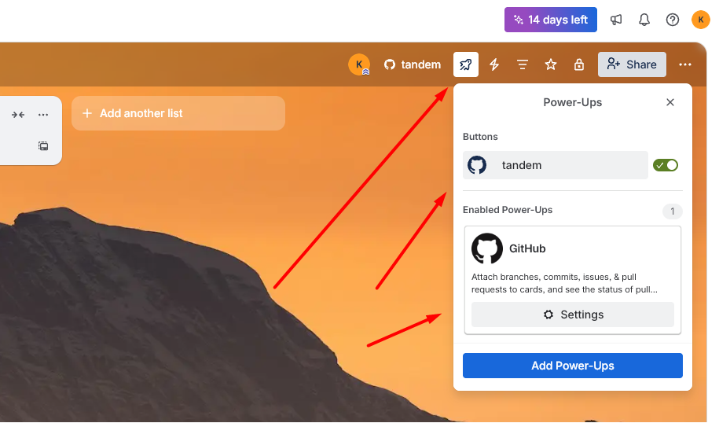

# Date: 18-02-2026

- **What was done:**
  1. Created a private repository "tandem" with a short project description:
https://github.com/KarpovDmitriy/tandem

  2. Created a private Trello board: https://trello.com/b/HMCtQUS9/tandem-board. Added 5 lists: Backlog, To Do, In Progress, Review, Done. So that cards can be moved between them to track task progress.

  3. Connected Trello with GitHub using Power-Ups in Trello.

  4. Had a call with the team, discussed documentation, application architecture, and distributed tasks for the first sprint.

- **Problems:**
I encountered a problem when connecting the GitHub repository to the Trello board.

- **Solutions (or attempts):**
  As it turned out later, Trello has two ways to add repositories from GitHub, and one of them simply did not work - I could see the list of my repositories, but none of them could be selected. If we see the repository list, the connection is obviously established, but for some reason I could not choose any repository, and there was no error or notification from Trello.
  
  We had a call with the mentor, I wrote a message in the RS School chat (maybe someone had the same problem). In the end, while watching several YouTube videos together with the mentor, I accidentally found the solution - I discovered the second way to add the repository to the Trello board, and it worked:

  

- **Thoughts / Plans:**
  Tomorrow I plan to add team members to the created repository and to the Trello board. I also plan to watch React lessons because our application will be built with React.

- **Time spent:** 5 hours.